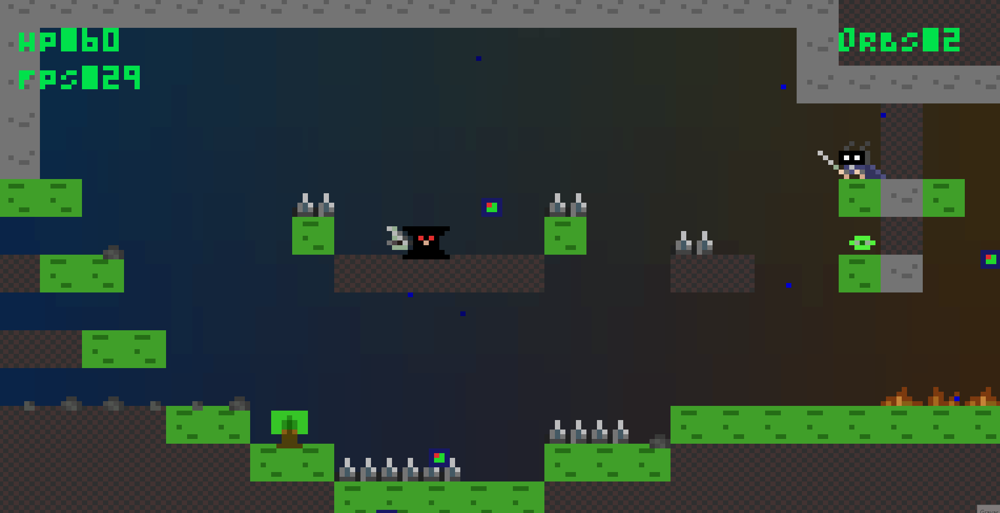

<h1 align="center">
Soul Knight
</h1>

<p align="center">
  
</p>

## Deployment (Docker)

If native I/O isn’t working in your environment, you can run the game on Linux in a container. The game uses a TTY when headless, so run the container interactively.

Quick start
- Build the image: `docker build -t hollowknight .`
- Run interactively: `docker run --rm -it hollowknight`

Using Docker Compose
1) Use the provided docker-compose.yml in the repo (see below for its contents).
2) Start: `docker compose up --build`
3) Stop: `docker compose down`

docker-compose.yml
```
services:
  game:
    build: .
    image: hollowknight:local
    container_name: hollowknight
    tty: true            # allocate a TTY so Lanterna can use the terminal
    stdin_open: true     # keep STDIN open for key events
    environment:
      - TERM=xterm-256color
```

Notes
- The container runs in headless/TTY mode; an AWT window is not used. Use an interactive terminal for best results.
- On macOS, running directly with Gradle/IntelliJ is still recommended (see below). Docker is most useful for Linux.

## Build and Run (macOS)

Prereqs
- Install a JDK (21 or newer recommended; tested up to JDK 23)
- Ensure you open/run the project via Gradle in IntelliJ (do not create a plain Java run config without the module classpath)

Using Gradle (recommended)
- Build: `./gradlew clean build`
- Run: `./gradlew run`
  - Note: Lanterna opens an AWT terminal window. Run from a normal macOS session (not a headless/CI shell).
- Create a fat JAR: `./gradlew shadowJar`
  - Then run: `java -jar build/libs/HollowKnight-1.0-all.jar`

Using IntelliJ IDEA
1) Open the project as a Gradle project (File > Open > select the build.gradle).
2) Set the Gradle JVM and Project SDK to the same installed JDK (Settings > Build Tools > Gradle and Project Structure > SDKs).
3) Preferred: Run the Gradle task Run (Gradle tool window > Tasks > application > run).
4) Alternatively, create an Application configuration:
   - Main class: `HollowKnight.Game`
   - Use classpath of module: `HollowKnight.main`
   - Working directory: project root (default is OK)
   - JRE: your configured JDK 21+ (e.g., Temurin 21/23)

Troubleshooting “Could not find or load main class HollowKnight.Game” in IntelliJ
- Ensure you’re using an Application configuration with “Use classpath of module” set to `HollowKnight.main`. If this field is empty or set to a wrong module, the class won’t be found.
- Prefer running via Gradle (the Gradle run task guarantees the correct classpath).
- Reimport Gradle project: In the Gradle tool window, click “Reload All Gradle Projects”.
- Rebuild the project: Build > Rebuild Project.
- Invalidate caches: File > Invalidate Caches… > Invalidate and Restart.
- Verify capitalization: the package name is exactly `HollowKnight` (case-sensitive on some filesystems).
- Delete generated outputs if needed: remove the `build/` and `.gradle/` folders, then `./gradlew clean build`.

Known environment notes on macOS
- If running from a headless shell or CI, Lanterna may fail with a `/dev/tty` error. Run the game from a normal macOS user session (Terminal/iTerm or inside IntelliJ) so the AWT window can be created.
- On Apple Silicon, ensure the JDK build matches your CPU (arm64). Temurin, Oracle, or Zulu JDKs work fine.
- Audio uses Java Sound (javax.sound). If you don’t hear audio, check the system output device/volume.

## Project Description
**Soul Knight** is a game inspired by platformer games like *Hollow Knight*, but with some distinct ideas. In this world, everything is trying to kill you, and you are a warrior of great prestige and renown. Your goal is to survive and traverse this underground world to escape.

## Mockups

[comment]: <> (Menu Design)

<h3 align="center">
  Menu Design
</h3>

<p align="center">
  
</p>

[comment]: <> (Level Design Example)

<h3 align="center">
  Level Design Example
</h3>

<p align="center">
  
</p>

[comment]: <> (Settings Menu Example)

<h3 align="center">
  Settings Menu Example
</h3>

<p align="center">
  
</p>

[comment]: <> (Credits  Example)

<h3 align="center">
  Credits  Example
</h3>

<p align="center">
  
</p>

[comment]: <> (The thunder effect)

<h3 align="center">
  The thunder effect
</h3>

<p align="center">
  
</p>

[comment]: <> (Particles Fuild engine)
<h3 align="center">
  Particles Fuild engine
</h3>

<p align="center">
  
  

</p>

[comment]: <> (Character movement and Design)
<h3 align="center">
  Main Character Movement and Design
</h3>

<p align="center">

</p>

[comment]: <> (Monsters and Elements Design)
<h3 align="center">
  Monsters and Elements Design
</h3>

<p align="center">
  
</p>

[comment]: <> (Collectables)

<h3 align="center">
  Speed Orb and Health Orb
</h3>

<p align="center">
  
  
</p>

## General Structure
<p align="center">
  
</p>
