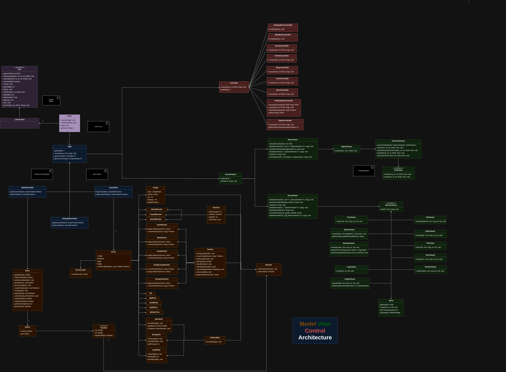

<h1 align="center">
  LDTS_T02G07 - Soul Knight
</h1>

## Project Description
**Soul Knight** is a game inspired by platformer games like *Hollow Knight*, but with some distinct ideas. In this world, everything is trying to kill you, and you are a warrior of great prestige and renown. Your goal is to survive and traverse this underground world to escape.

## Implemented Features
- **Menu** - The game has a Menu that has
  the following options:
- **Start** - Starts a new game.
- **Exit** - Exits the game.
- **Player** - The player has the following characteristics:
- **HP (Health Points)**: The player's life is represented by an integer. If it reaches zero, the player dies.
- **Energy**: The player accumulates energy to perform a special attack.
- **Movement**: The player can move (using the arrow keys) at variable speeds, jump and DoubleJump. The player's movement animations change according to the player's current action and speed.
- **Collectables** - Collectables are "Orbs" that will give the player a "PowerUp" and enhance his abilities. They are scattered around the map and the player can pick them up.
- **Particles** - Particles accompany a lot of actions, it is like a system within the game. They are present in the Menu, giving a kind of "Visual Flair", and also in a lot of
  player animations, such as Jumping and dying. There exists another system that simulates a Fluid's particles, so they don't disappear into thin air and actually stay around the map
  just like rain would. Death, Dash, Jump, DoubleJump and Menu have Particles implemented.
- **Game Physics** - We have applied collisions to all the elements in the game.
- **Scene Loader** - Class to load levels of written text files with specific characters, allowing to generate tiles and other elements for the different scenes/levels and allows for simple layout editions.
- **Varied Experiences** - Various levels to provide a more diversified experience.
- **Interface** - Display of important player stats and information (e.g., health, energy).
- **Advanced Movement** - Ability to dash, helping the player evade strikes and move quicker.
- **Enemies** - Logic and hitboxes for each enemy type.
- **Damage Taken** - When the player gets hit by one of the monsters his health goes down.

## CONTROLS

`->`: Moves the player to the right.

`<-`: Moves the player to the left.

`SPACE`: Makes the player jump.

`q`: Kills the player

`ESC`: Press ESC to quit or return to the main menu.

`ENTER`: Press ENTER to select the desired options in the menu.

## General Structure

  

## Design

### Code Structure

#### Problem in Context

When developing software that interacts with a user interface, it's critical to establish an appropriate structural design. The code needs to be organized and separated effectively to adhere to the **Single Responsibility Principle**.  
This is especially important in games, where different components (such as handling user input, rendering visuals, or managing game logic) must be dealt with independently.

#### The Pattern

To address this, we implemented the **Model/View/Controller (MVC)** pattern, a well-known approach in Graphical User Interface (GUI) design. This pattern divides the codebase into three distinct sections:
- **Model**: Manages the data, rules, and core game logic.
- **View**: Handles the display of the model and routes user actions to the controller.
- **Controller**: Bridges the model and view, interpreting user actions and updating the model accordingly.

#### Implementation
The following diagram illustrates this structure:

  

#### Consequences

Adopting this architecture pattern has allowed us to maintain well-organized, modular code. Changes made to one component can be implemented with minimal risk of breaking functionality elsewhere. This segregation of responsibilities is particularly beneficial for scaling or enhancing the game in the future.

---

### Game Loop

#### Problem in Context

When creating a game, it’s crucial to have a mechanism that updates the state of every entity over time. Early in development, you might only want the game to run continuously without requiring input. However, as the game becomes more complex and includes more entities, you'll need to regulate how quickly it runs and how often visuals are updated on screen.  
This is also essential for ensuring consistent performance across systems with varying hardware capabilities. Without such control, the game speed might fluctuate depending on the system.

#### The Pattern

A widely used solution for this challenge is the **Game Loop** pattern. This is essentially a while-loop that continues running as long as the game is active (for example, until the user exits).  
Within this loop, a target FPS (frames per second) is defined, representing how often the visuals should update in a second. Using the target FPS, we can calculate how long the main execution thread needs to pause before proceeding to the next iteration.  
This ensures the game runs consistently, providing a smooth experience for players on different systems.

#### Implementation
The following diagram illustrates the flow of this pattern:

  

#### Consequences

Implementing the Game Loop pattern provides several benefits, including smooth and consistent gameplay across various systems and the ability to precisely control the execution speed of the game.  
However, some linters may flag the use of thread-sleeping commands inside loops as bad practice, since they involve idle waiting. While this is true in general programming, it’s a standard and expected practice in game development to achieve consistent timing.

### Player States

#### Problem in Context

While implementing the player's movement, we wanted to restrict its movement while it's performing certain actions. For example, the player should not be able to jump right after jumping, it should not dash right after dashing, etc. Also, determining in what state the player is is useful for its respective animations.
Initially, we had the player's state stored in a lot of **flags** inside of the Player class, which not only was confusing to understand from those flags what exactly the player was doing but also made the code that updated the player's movement very long and messy. It also didn't favor the Open/Closed Principle very well, as we realized that slight alterations to one part of the movement impacted others in unpredictable ways.

#### The Pattern

For this problem, we recurred to the **State** Pattern once again. As stated before, this pattern suggests creating an abstract class for the player state and implementing each one of the concrete states as their own subclass, with their own implementation of the needed player's actions and state transitions.

#### Implementation

The implementation of this pattern can be found in the [abstract class KnightState](/src/main/java/HollowKnight/model/game/elements/Knight/KnightState.java),
as well as its subclasses: [IdleState](/src/main/java/HollowKnight/model/game/elements/Knight/IdleState.java),
[WalkingState](/src/main/java/HollowKnight/model/game/elements/Knight/WalkingState.java),
[RunningState](/src/main/java/HollowKnight/model/game/elements/Knight/RunningState.java),
[JumpingState](/src/main/java/HollowKnight/model/game/elements/Knight/JumpState.java),
[FallingState](/src/main/java/HollowKnight/model/game/elements/Knight/FallingState.java),
  and [RespawnState](/src/main/java/HollowKnight/model/game/elements/Knight/RespawnState.java).

This way, the player redirects the logic of movement to the state, and the state deals with the movement's actualization, with methods such as `movePlayerLeft()`, `jump()` or `updateVelocity()`.

A UML diagram describing the pattern implementation can be found below:

  

#### Consequences

With this pattern, all the phases of the player's movement became well segregated and intuitively identified, as well as more securely defined than with the flag fields. Also, the transitions between each state become much clearer and, if we were to add more states in the future, it would be as easy as adding another subclass (no need to potentially alter the behavior of other states to add another). It also allows for more flexible player movement, by allowing to make state-specific operations.

### Simplification of Lanterna's Interface

#### Problem in Context

To handle the visuals of our game, we needed a way to draw characters on the terminal and process inputs using Lanterna. However, Lanterna's API lacks straightforward functions for these tasks.
One solution would be to manually implement these functionalities every time we need them, but this approach leads to repetitive, non-modular code that is difficult to maintain.

#### The Pattern

To address this, we implemented the **Adapter** pattern. This design pattern involves creating a specialized object that acts as a bridge, translating the interface of one system (Lanterna) into a format that another system (our application) can easily use.
By introducing an adapter ,LanternaGUI, we provide our application's classes with a more intuitive and user-friendly interface for interacting with Lanterna's features.

#### Implementation

  

#### Consequences

Using the Adapter Pattern provides several benefits such as:

1. **Encapsulation of Lanterna-Specific Logic**  
   Our application classes no longer need to manage the intricacies of Lanterna, adhering to the **Single Responsibility Principle**.

2. **Improved Modularity**  
   By abstracting Lanterna's functionality, the codebase becomes more adaptable and easier to update or extend in the future.

This pattern simplifies interactions with Lanterna and supports long-term maintainability.

## TESTING

- We used unit testing and mocks for more complex tasks
- **[Coverage Testing](/docs/tests/TestCoverageResult.png)**
  - Class Coverage ≈ 78,5%
  - Branch Coverage ≈ 41,9% (for now with trivial test this is normal)
  

    
  
